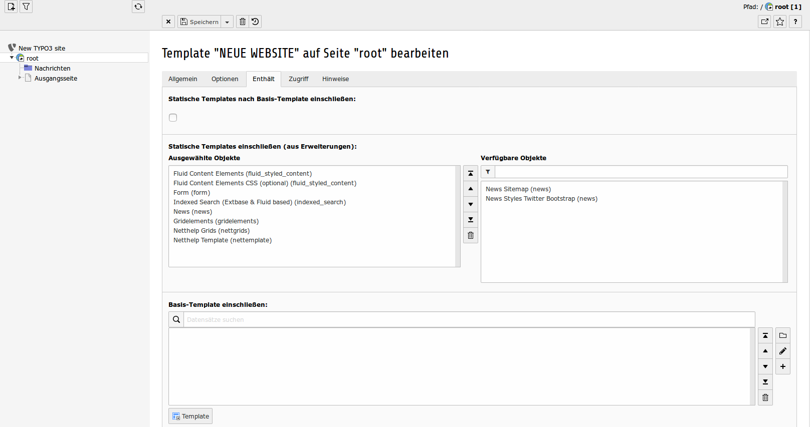
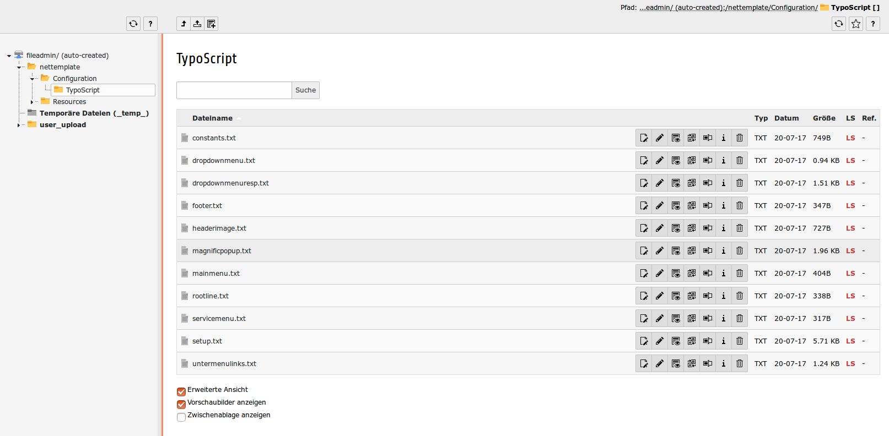

.. ==================================================
.. FOR YOUR INFORMATION
.. --------------------------------------------------
.. -*- coding: utf-8 -*- with BOM.

.. include:: ../Includes.txt

.. _admin-manual:

Administrator Manual
====================

Target group: **Administrators**

Describes how to manage the extension from an administrator point of view.
That relates to Page/User TSconfig, permissions, configuration etc.,
which administrator level users have access to.

Language should be non / semi-technical, explaining, using small examples.

.. _admin-installation:

Installation
------------

As long as the extension gridelements is not available in version> = 8.0.0 in the TER, the extension nettmplate can not be installed as a distribution, as a current gridelement has to be installed from the GIT. So nenmplate afterwards simply as normal extension set up.

Solange die Extension gridelements nicht in Version >=8.0.0 im TER verfügbar ist, kann die Extension nettemplate nicht als Distribution installiert werden, da ein aktuelles gridelements vorab aus dem GIT installiert werden muss. Also nettemplate danach einfach als normale Extension einrichten.

To install the extension, perform the following steps:

#. Go to the Extension Manager
#. Install the extension nettemplate
#. Load the gridelements static template
#. Load the nettgrids static template
#. Load the static template of this distribution

Zur Installation der extension sind folgende Schritte notwendig:
#. Auswählen des Menüpunktes Erweiterungen
#. Installation von nettemplate
#. Laden der statischen Templates von gridelements
#. Laden der statischen Templates von nettgrids
#. Laden der statischen Templates dieser Distribution

   Some static templates have to be included

   Einige statische Templates müssen eingebunden werden

.. _admin-configuration:

Configuration
-------------

   All typoscript files are located below fileadmin/nettmplate...

   Alle Typoscript-Dateien befinden sich unterhalb von fileadmin/nettemplate/

   See https://www.debacher.de/wiki/Seitentemplate_mit_Typo3_8.7 for a complete description.

   Siehe https://www.debacher.de/wiki/Seitentemplate_mit_Typo3_8.7 für eine vollständigere Beschreibung.