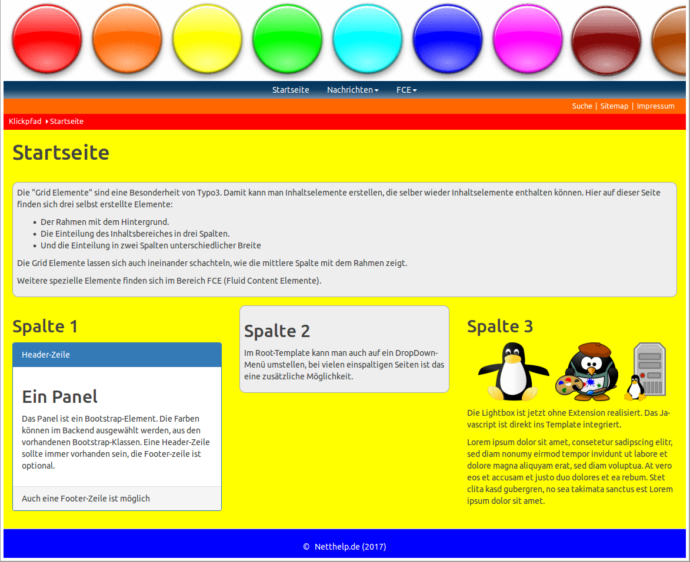

.. ==================================================
.. FOR YOUR INFORMATION
.. --------------------------------------------------
.. -*- coding: utf-8 -*- with BOM.

.. include:: ../Includes.txt

.. _introduction:

Introduction
============

.. _what-it-does:

What does it do?
----------------

The extension Nettemplate provides layouts with 1, 2 or 3 columns. In addition, all the necessary typoscript files are available in the distribution, as well as a number of sample contents that show the possibilities of the extension.

Die Extension Nettemplate stellt Layouts mit 1, 2 bzw. 3 Spalten zur Verfügung. Außerdem sind in der Distribution auch alle notwendigen Typoscript-Dateien vorhanden, sowie eine Reihe von Besipielinhalten, die die Möglichkeiten der Extension aufzeigen.

.. _screenshots:

Screenshots
-----------

This chapter should help people figure how the extension works. Remove it
if not relevant.

   Homepage after complete installation.

   Startseite nach vollständiger Installation.
